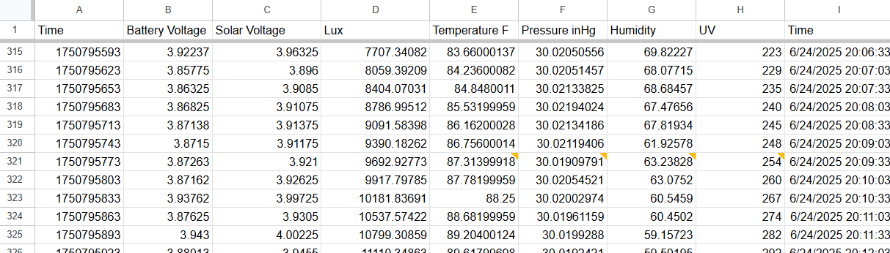
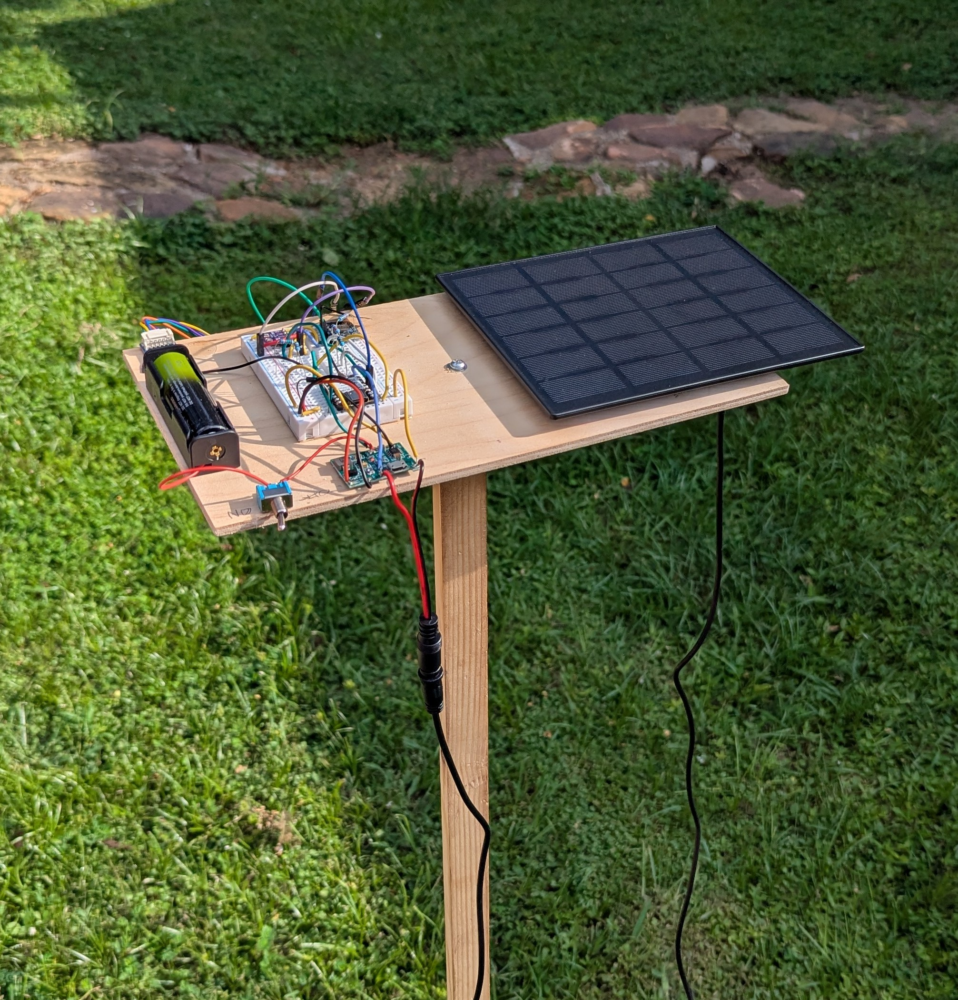

# Testing

The BME280, UV, and ambient light sensors were connected to the ESP32 via I2C and a simple program was created to check the sensor values and then display them on the serial monitor.

After testing each sensor the program was changed to upload the sensor values to a Google sheet [fig. 1]. After this was successful, the battery, charging module, and solar panel were connected to the setup and everything was mounted to a wooden board and pole for testing [fig. 2]. The testing rig was mounted about 4 feet above the ground to eliminate extra heat from radiation off the ground.

fig. 1

fig. 2

After allowing the sensors to acclimate to the conditions it was found that the values for all the sensors will need calibration, but this will wait until everything is probably mounted in the final enclosure. 
